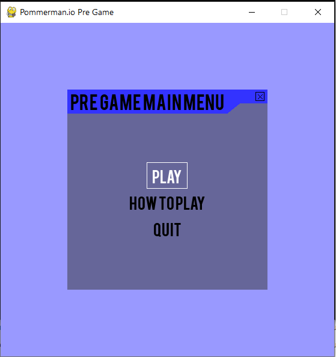
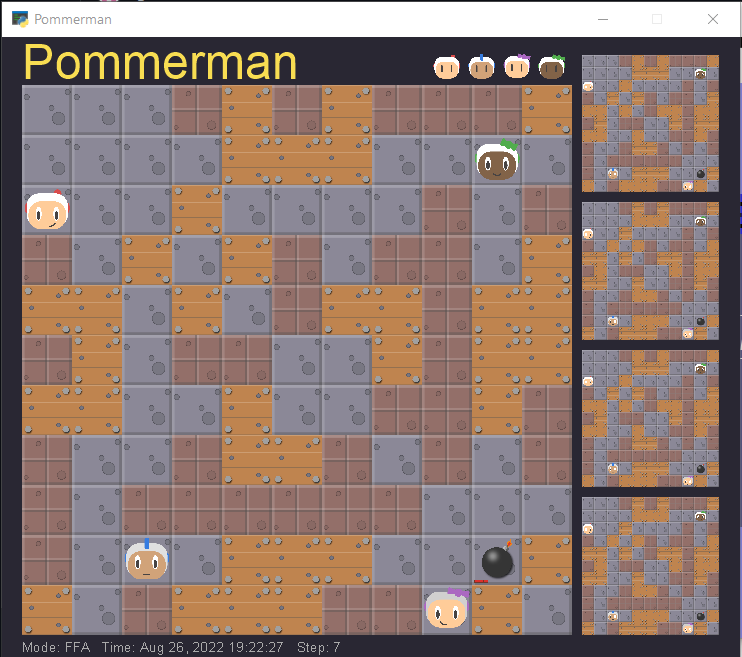
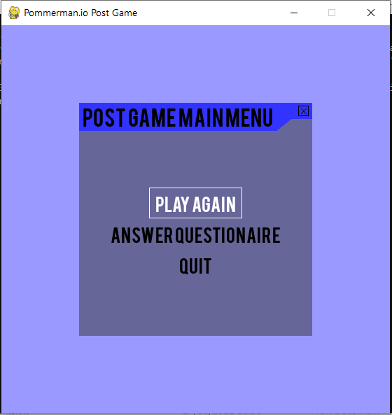

# Pommerman.Io-Game-with-A3C-Implementation-
Interactive Game based off the https://www.pommerman.com Competitions 

The A3C algorithm implementation used for the game was influenced by Mirza Hasanbasic and Eugene Zainchkovskyy -  https://github.com/eugene/pommerman

# The Game 

A3C Agent (Red Agent) - Agent that uses the A3C DRL algorithm and has been trained on 25,000 games

Random Agent (Blue Agent) - Agent that randomly  chooses an action from the games 6 set actions 

Simple Agent (Purple Agent) - Agent which uses rule-based systems and Dijkstra’s algorithm 

Player Agent (Green Agent) - Agent which is controlled by the player

  
   
  

# Development Requirements
To develop this game there are certain installations required ranging from programming language to library dependencies: 

Python >= 3.6

pygame>=2.1.2

pygame-menu>=3.5.8

torch>=1.11

Pommerman playground (https://github.com/MultiAgentLearning/playground) 
-	Read the README.md to see how to install the playground and its dependencies

# Training Requirements 
To train the A3C model put the ‘A3C.py’ and ‘sharedAdam.py’ files in the pommerman folder and run the file A3C.py. This will create a model called ‘A3C_v10_cnn_lstm_trained_critic_actor_1.pth’ trained on 25,000 games. The number of trained iterations can be changed in the A3C.py file 

# Running the game (Development build)
In order to run the game you will need to move the model to the main playground folder and execute the main.py file 

# Game build with 25k training iterations and Dissertation Questionairre 
The Itch.io game link =  https://gumad.itch.io/pommermanio

The Microsoft Forms Questionnaire link = https://forms.office.com/r/CpTww4BfdK 

# Dissertation Paper 

<a href="https://github.coventry.ac.uk/gumad/Pommerman.Io-Game-with-A3C-Implementation-/blob/main/DissertationPaper.pdf">Dissertation Paper</a>

